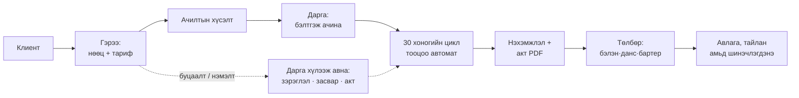

# Жигүүр Зам ХХК — Түрээс, худалдааны удирдлагын систем

**Төслийн зураглал v1.1** · 2026.08.23 · ✅ Үе 1 + Үе 2 бүрэн хэрэгжсэн (49 автомат тесттэй) — `system/` фолдерт

---

## 1. Юуг сольж байна

Одоо бүх зүйл Messenger чат, гар падан, Numbers файлын 24 sheet (харилцагч бүрт нэг хуудас) дээр явж байна. Үүнээс болж авлага бүрхэг, хугацаа хэтрэлт анзаарагддаггүй, бартерын алдагдал тоогоор харагддаггүй.

Системд бүх зүйл **гэрээнээс** урсана: бараа хөдөлгөөн бүр (гарсан, буцсан, нэмэгдсэн, акталсан) нэг л удаа бүртгэгдэнэ, түүнээс нөөц, түрээсийн тооцоо, нэхэмжлэл, авлага, тайлан бүгд автоматаар гарна. Хэн ч юуг ч давхар бичихгүй.

## 2. Баталгаажсан бизнес дүрмүүд

Гурван Numbers файлаас гаргаж, хэлэлцэж баталсан дүрмүүд:

1. **Тариф гэрээ бүрт өөр.** Марч 300₮/ш/хоног. Блүүм: хэв 330₮, тулаас В2 110₮, В4 220₮, труба 6м 220₮, 3м 200₮. → Гэрээ үүсгэхдээ материалын төрөл бүрт хоногийн тариф зааж өгнө (каталогийн суурь тарифаас эхэлж засна).
2. **Тооцооны үе = гэрээний өдрөөс эхэлсэн 30 хоногийн цикл** (3.15–4.13, 4.14–5.13…). Календарын сар биш.
3. **Буцаалт хоногоор пропорц бодогдоно.** Дундуур буцаасан багц тухайн үлдсэн хоногоороо тусдаа мөр болно — систем автоматаар үүсгэнэ.
4. **Акт болон засварын төлбөр нэхэмжлэлд нэмэгдэнэ.** Засварын фикс үнүүд Settings-д, эвдэрсэн бараа хүлээн авахад автоматаар харилцагчийн тооцоонд орно.
5. **Төлбөрийн хэлбэр: бэлэн / данс / бартер.** Бартер бол төлбөрийн нэг төрөл — машин, байр, материал төлбөрт орж ирдэг.
6. **Бартер хөрөнгө**: орж ирсэн үнэ ↔ борлуулсан үнийн зөрүү = бартерын ашиг/алдагдал, тайланд тусдаа мөрөөр.
7. **Зэрэглэл динамик.** Менежер Settings-д зэрэглэлийн жагсаалтыг өөрөө удирдана (шинэ, А, В, С… чөлөөтэй нэмнэ/өөрчилнө). Бараа + зэрэглэл бүрд өөрийн НБҮнэ, худалдах үнэ, нөөц. Плас/шорт/сольсон зэрэг ангиллыг мөн зэрэглэл эсвэл тусдаа бараа болгож бүртгэж болно. Буцаж ирэхэд **дарга зэрэглэлийг тогтооно**.
8. **Худалдаа** зэрэглэлээр өөр үнэтэй, төлбөр хэсэгчилсэн байж болно (график үүсгэнэ).
9. **Үнийн санал** гаргаж хэвлэнэ/илгээнэ.
10. **Тооцоо нийлсэн акт** — хоёр тал гарын үсэг зурдаг PDF, системээс хэвлэнэ.
11. **Зээл, өглөг**: банк + хувь зээлдүүлэгч, сарын хүү (1.55%–3%), төлөлтийн график. Нийт ~8.7 тэрбум — тайлангийн заавал хэсэг.
12. **Алданги**: суурь 0.5%/хоног, Settings-д өөрчлөгдөнө, гэрээ бүрт override.

## 3. Модулиуд (8)

| # | Модуль | Юу хийх |
|---|--------|---------|
| 1 | **Бараа материал** | Каталог: төрөл (Хэв / Тулаас / Труба / Механизм), код (6012, В2, 3м…), динамик зэрэглэл, зэрэглэл бүрийн үнэ, суурь тариф. Засварын фикс үнүүд. |
| 2 | **Агуулах** | Амьд үлдэгдэл зэрэглэл бүрээр: Агуулахад / Түрээсэнд / Засварт / Акталсан. Тооллого хийх дэлгэц (баримт ↔ бодит зөрүү). |
| 3 | **Харилцагч** | Компани, холбоо барих, гэрээнүүд, авлагын түүх, барьцаа, зээлийн лимит, хавсралт файлууд. |
| 4 | **Бартер** | Орж ирсэн хөрөнгө (байр/машин/материал), үнэлгээ, борлуулалт, ашиг/алдагдал. |
| 5 | **Механизм (Автокран)** | Өдрийн ажлын log (бүтэн/хагас өдөр, харилцагч эсвэл дотоод), орлого бэлэн/бартер, зарлага (түлш, сэлбэг, жолооч), механизм бүрийн ашиг. |
| 6 | **Санхүү** | Odoo түвшний стандарт — §6-г үз. Нэхэмжлэл, төлбөр, зээл/өглөг, касс. |
| 7 | **Цалин** | Үндсэн (сард 2 удаа, заримд НДШ) · Гэрээт (сард 2 удаа, заримд НДШ) · Өдрийн (ажилласан өдрөөр). Жолооч, засварчны хөлс энд холбогдоно. |
| 8 | **Тайлан ба аналитик** | Embedded дашбоард, Metabase түвшний chart-ууд — §7-г үз. |

**Гэрээ** бол модуль биш — системийн зүрх. Бүх модуль үүнээс мэдээлэл авна.

## 4. Хэн юу харах вэ

**Отгоо эгч (Менежер).** Гэрээ үүсгэх хялбар wizard: харилцагч сонгох → материал нэмэхэд боломжит нөөц шууд харагдана → тариф, хугацаа, алданги, барьцаа → хадгалмагц ачилтын хүсэлт дарга руу. Буцаалт/нэмэлт бүртгэх, нэхэмжлэл + акт хэвлэх, үнийн санал, санамжууд. Зэрэглэлийн жагсаалт удирдах.

**Үйлдвэрийн дарга.** Ачилтын дараалал → бэлтгэсэн/ачсан. Буцаалт хүлээн авах: тоолно, зэрэглэл тогтооно, эвдэрсэнг засварт (фикс үнэ автоматаар тооцоонд), болохгүйг актална. Тооллого. *Утас/таблетад зориулсан том товчтой, touch-first дэлгэц.*

**Санхүүч.** Төлбөр бүртгэх ба хуваарилах, авлага + алданги, зээлийн график, касс, цалин, бүх тайлан, export.

## 5. Нийтлэг чадварууд

- Гэрээний 30 хоногийн цикл автоматаар урагшилна; дуусахаас өмнө мэдэгдэж, сунгалт нэг товчоор.
- Нэхэмжлэл цикл бүрд автоматаар үүснэ — буцаалт, нэмэлт, акт, засвар тооцогдсон.
- Нөөц хөдөлгөөн бүртгэгдэнгүүт шууд шинэчлэгдэнэ.
- Мэдэгдэл (систем дотор): дуусаж буй гэрээ, төлөгдөөгүй/хэтэрсэн нэхэмжлэл, барагдаж буй нөөц.
- **Файл хавсаргах**: гэрээний скан, падангийн зураг, дурын файлыг гэрээ / харилцагч / төлбөр / бартер дээр хавсаргана.
- **Import**: Excel/CSV-ээс каталог, харилцагч, эхний үлдэгдэл оруулна.
- **Export**: бүх жагсаалт, тайлан XLSX болон PDF-ээр татагдана.
- Audit log: хэн, хэзээ, юу өөрчилснийг бүртгэнэ.

## 6. Санхүү модуль — Odoo түвшний стандарт

- Нэхэмжлэлийн амьдралын мөчлөг: **Ноорог → Илгээсэн → Хэсэгчлэн төлөгдсөн → Төлөгдсөн / Хугацаа хэтэрсэн**.
- Төлбөр хуваарилалт: нэг төлбөрийг олон нэхэмжлэлд, эсвэл нэг нэхэмжлэлийг олон төлбөрөөр хаана.
- Кредит бичилт (залруулга, буцаалтын тохиргоо).
- Алданги авто-бодолт; НӨАТ тусдаа мөр (и-баримт холболт Үе 3-т).
- Харилцагчийн хуулга (statement) + тооцоо нийлсэн акт PDF.
- **Зээл/өглөг**: зээлдүүлэгч, үндсэн дүн, сарын хүү, төлөлтийн график, төлсөн/үлдэгдэл, сар бүрийн нийт дарамт.
- Касс/дансны орлого-зарлага (Автокраны түлш гэх мэт зарлага энд бүртгэгдэнэ).

## 7. Аналитик — embedded, Metabase түвшин

- **Нүүр дашбоард**: авлагын нийт үлдэгдэл, хугацаа хэтэрсэн дүн, идэвхтэй гэрээний тоо, түрээсэнд гарсан нөөцийн %, сарын орлогын trend, зээлийн ойрын төлөлтүүд.
- Модуль бүрт chart: авлага насжилтаар (bar), орлого сараар (line), орлогын бүтэц түрээс/худалдаа/механизм (pie), материалын ашиглалтын % (bar), бартер ашиг/алдагдал, зээлийн үлдэгдлийн график.
- Бүх chart хугацаа/харилцагч/материалаар шүүгдэнэ, зураг болон XLSX-ээр татагдана.

## 8. Технологи

**Backend**: Python 3.12, FastAPI, SQLAlchemy. **DB**: Neon Postgres (үндсэн, prod). Локал хөгжүүлэлт болон тестэд SQLite горим — нэг schema хоёуланд ажиллана. Гэрээ→хөдөлгөөн→нэхэмжлэл→төлбөр гэсэн гинжин (graph) асуулгуудыг Postgres recursive CTE + view-ээр шийднэ — тусдаа граф DB хэрэггүй, "удаан байж болно" гэсэн болзолд бүрэн багтана.

**Frontend**: React + Vite + TypeScript, Tailwind CSS, Framer Motion (зөөлөн хөдөлгөөн, transition), touch-first (үйлдвэрт таблет/утас), бүхэлдээ Монгол хэлээр. Charts: ECharts. Харагдах байдал: цэвэрхэн, орчин үеийн, хөнгөн хөдөлгөөнтэй — эхний UI prototype дээр хамт тохирно.

**PDF**: нэхэмжлэл, тооцооны акт, үнийн санал server-side үүснэ. **Auth**: 3 роль, нууц үг, session.

## 9. Барих дараалал

**Үе 1 — MVP.** ✅ Хийгдсэн: каталог + динамик зэрэглэл, нөөц, харилцагч, гэрээ + хөдөлгөөн + 30 хоногийн авто тооцоо, нэхэмжлэл + акт PDF, төлбөр, авлага + кредитийн автомат хуваарилалт, мэдэгдэл, дашбоард, mock data, 3 роль.

**Үе 2.** ✅ Хийгдсэн: Бартер бүрэн (авто-үүсгэлт, зарах, ашиг/алдагдал, нөөцөд оруулах), Механизм (Автокран — өдрийн log, P&L), Зээл/өглөг (хүү/үндсэн, график, дашбоард), Цалин (15/15, НДШ, өдрийн), Тайлан (P&L + мөнгөн урсгал + Excel), Import/Export.

**Үе 3.** И-баримт, QPay, бодит дата шилжүүлэлт (Numbers → систем), дизайны өнгөлгөө.

**Mock data**: Numbers файлын бодит бүтцээр (материалын кодууд, тарифын хэв маяг, циклийн логик) зохиомол нэрстэй үүсгэнэ. Бодит датаг MVP бүрэн дууссаны дараа оруулна.

---

*Шийдэгдсэн: зэрэглэл динамик · Автокран орно · Зээл/өглөг орно · mock data (бодит импорт MVP-ийн дараа) · "nemelt data" файл хамааралгүй гэж үзсэн.*
